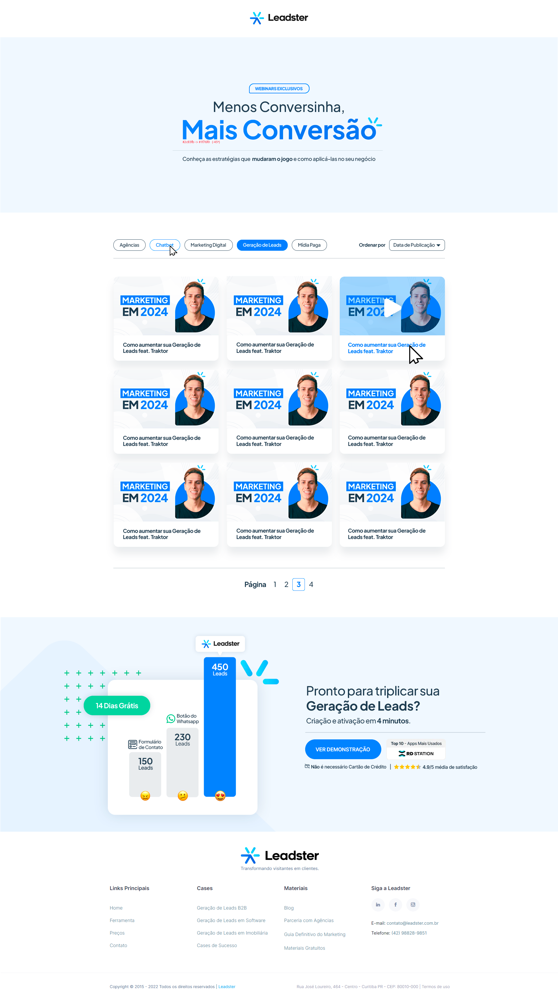

<h1 align="center">Teste Leadster</h1>

 

Este projeto foi desenvolvido pela Leadster para o teste front-end.

 

<h2>👩‍💻 Tecnologias</h2>

 

<h2>📱 Projeto</h2>

O projeto consiste na criação de uma landing page com o framework NextJS utilizando um arquivo JSON com o conteúdo do modal.

Este projeto por ter o layout como imagem, teve alguns desafios como saber os tamanhos das fontes, espaçamentos entre os elementos e responsividade. Também foi um pequeno desafio fazer os filtros serem funcionais, mas foi bem prazeroso de ser finalizado. O projeto levou em torno de 10 horas para ser concluído.

